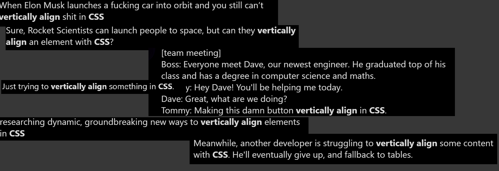
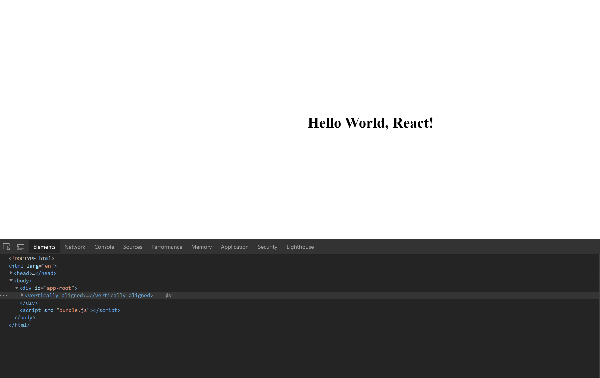

# Vertically Aligned

Small (<1kb) and native web component designed to verically align elements on a page.

## Demo

Check it out on [Codepen](https://codepen.io/laragno/pen/JjGLzaa).

## Why?

Seems like vertically align is still an issue? I still see a lot of people joking/complaining about this, so I guess this component will have an audience.




## How to use it

On your regular websites just include the script and use the component

```html
    <vertically-aligned>
      <h1> content !!! </h1>
    </vertically-aligned>

    ...
    <!-- use it from the CDN> -->
    <script src="https://unpkg.com/vertically-aligned@2.0.0/dist/bundle-browser.js"></script>
```

On react,preact and similar frameworks you can install the dependency:

```bash
npm install vertically-aligned --save
```

then import it: 
```javascript

import React, { Component } from 'react';
import 'vertically-aligned';

class HelloWorld extends Component {
  render() {
    return (
      <vertically-aligned>
       <h1>Hello World, React!</h1>
      </vertically-aligned>
  ); 
  } 
} 

export default HelloWorld;
```

That should output something like this:




## No Flex? No problem!

Add the attribute `noFlex` to the HTML tag and it will use table styles.

```html
    <vertically-aligned noFlex>
      <h1> content !!! </h1>
    </vertically-aligned>
```


## Don't wanna install a dependency?

Just copy the content of `index.js` on your app, there are only 55 lines of code there (w/o minification). Then include that file on your app and you can use it without installing or managing anything.